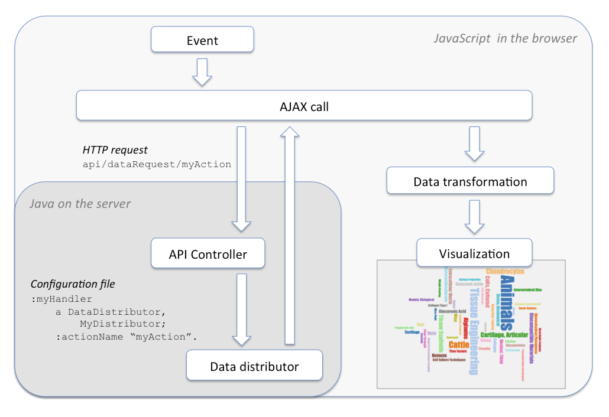

# The Data Distribution API

This API was developed at Cornell University as part of the Scholars@Cornell 
project. This document includes some discussion that was prepared for that
project. 

The API is implemented by a set of specific Java classes. A set of 
implementations is described after the discussion.

## Scholars@Cornell

### The challenge

Visualizations can be created in the browser using powerful JavaScript 
libraries like D3 or InfoViz. Such libraries create visualizations that are 
animated, responsive, and captivating. This approach permits the power of the 
user’s computer is harnessed to produce the actual display. The Scholars server 
is only required to provide the data – a difficult task in itself.

We can envision a range of data sets that would be required for these 
visualizations. This will certainly include queries against the Scholars 
triple-store and search index. It will also include data sets that require 
extensive processing. These will likely be created by batch processes and 
cached for serving on demand. Some data sets might include real-time data 
from services at other sites.

Existing APIs in VIVO are not flexible enough to handle these requirements. 
The SPARQL query API could provide data for real-time queries against the 
triple-store. But how to handle the other types of data sets? 

Further, existing APIs do not provide the granularity of authorization that we 
require. Users should be able to see these visualizations without logging in to 
Scholars., but that would mean opening the SPARQL query API to anonymous use. 
This might reveal restricted data to the public. It would certainly allow the 
public to issue SPARQL queries that would consume all of the server’s resources.

It is important to remember that the requests for data cannot be restricted to 
visualization scripts. If the JavaScript on the browser can obtain data, then 
that same data may be obtained by any client using HTTP, and used for any 
purpose.

### The approach

The chosen solution is to create the Data Distribution API in Scholars. This is 
an addition to the core VIVO code, and is being submitted to the VIVO community 
for adoption into the core.

The Data Distribution API permits a site administrator to create a 
configuration file that enables requests for data from different sources. Each 
type of request is assigned a name, so it can be requested by the browser. The 
JavaScript code on the browser requests a data set by name, supplying 
qualifying parameters as appropriate. The JavaScript code requires no knowledge 
of how the response was produced. It merely requests the data set and creates a 
visualization from the response.

Because each request type must be configured by a site administrator, there is 
no opportunity for users to make unexpected or unauthorized requests. Requests 
may be restricted to logged-in users, or even to users who are logged in with a 
specific authorization level. Users without sufficient authorization will 
receive no data.

It is important that the actual source of the data is hidden from the 
JavaScript request. This means that the site administrators are free to change 
the mechanism that provides the data. If a request takes too long to fulfill, 
the site admins can change the configuration, satisfying the request from a 
file of cached data, instead of a query in real-time.
 
### The API design

 
On startup, the Scholars server loads a configuration file that associates data 
requests with the means of satisfying them. The configuration includes the name 
of a Java class that will supply the data, along with any parameters that the 
class requires.

The Java class implements the DataDistributor interface. This means that the 
API controller can ask what action the class satisfies and what MIME type 
should be assigned to the resulting data. The API controller asks the 
distributor class to produce the data, and the controller routes the data to 
the user.

To illustrate, consider a request that will be satisfied by data cached in a 
file. A `FileDistributor` class is provided to do this, and the configuration 
file provides that class with the information it needs to satisfy the request.

The relevant section of the configuration file might look like this:

    :collaborations
        a   <java:edu.cornell.scholars.api.distribute.FileDistributor> ;
        :actionName "collaboration_sunburst" ;
        :path "dataCache/cached_collab_data.json" ;
        :contentType "application/json" .

The API controller responds to a request like this

    http://scholars.cornell.edu/api/distribute/collaboration_sunburst
    
by creating a `FileDistributor`, which copies the contents of a file to the 
HTTP response.

For a more elaborate example, consider a request that will be satisfied by the 
results of a SPARQL query against the triple-store. A Java class named 
`SparqlDataDistributor` is provided for this sort of request, and the 
configuration file will tell it what SPARQL query to use.

The relevant section of the configuration file might look like this:

    :simple_query
       a <java:edu.cornell.scholars.api.distribute.SparqlDataDistributor> ;
       :actionName "simple_query" ;
       :contentType "application/sparql-results+json" ;
       :selectQuery """
         PREFIX vivo: <http://vivoweb.org/ontology/core#>
         SELECT *
         WHERE {
           ?grant a vivo:Grant .
           ?grant rdfs:label ?grantTitle .
         }
         """ .

The API controller responds to a request like this

    http://scholars.cornell.edu/api/distribute/simple_query
    
by creating a `SparqlDataDistributor`, which will run the configured query 
against the triple-store and provide the results to the HTTP response.

One of the powerful concepts in this design is that the Java class can be 
written as special-purpose code for a single use, or as general-purpose code 
which can be configured for each use case. We expect to see more 
general-purpose `DataDistributor` classes, such as: 

+ `SolrDataDistributor`, for queries against the search index.
+ `HttpRelayDataDistributor`, for queries against services at other sites.

In spite of this, special-purpose code will remain the best solution for some 
unusual data sets.

## Configuration

The configuration of the `DataDistributor` instances is dictated by RDF in the 
Vitro display model. The most common way to create such triples would be to 
add one or more files of RDF to the `rdf/display/everytime` folder in the Vitro 
home directory.

_Note: the RDF examples shown below require a default namespace of 
`http://vitro.mannlib.cornell.edu/ns/vitro/ApplicationSetup#`_

## Existing implementations

### `DataDistributor` classes ###

The existing implementations build HTTP responses from pre-existing files, or
from queries against the Vitro triple-store, or from the outputs of co-operating
`ModelBuilder` instances.

However, we can imagine `DataDistributor` classes that build responses from very
different sources of data.

#### `FileDistributor`

The simplest data distributor. Sends the contents of a file as an HTTP response. 

| Parameter | Meaning | How many? |
| --- | --- | --- |
| `actionName` | as above | exactly one |
| `path` | The location of the file, relative to the Vitro home directory. | exactly one |
| `contentType` | The MIME type to be sent in the HTTP response header. | exactly one |

**Example:** 

    :data_distributor_organization_research_areas
        a   <java:edu.cornell.mannlib.vitro.webapp.controller.api.distribute.DataDistributor> ,
            <java:edu.cornell.mannlib.vitro.webapp.controller.api.distribute.FileDistributor> ;
        :actionName "organization_research_areas" ;
        :path "visualizationData/bme_research_areas.ttl" ;
        :contentType "text/turtle" .

#### `SparqlSelectDataDistributor`

Executes a SPARQL SELECT query against Vitro's content triple-store, and 
returns the results in JSON format: `application/sparql-results+json`.

You may specify the names of variables in the SPARQL query that should be bound
to request parameters before the query is executed. Each value may be bound as
a URI or as a plain literal value. If the request does not contain exactly one 
parameter for each specified binding, the response will be `400 Bad Request` 
with an informative message.

| Parameter | Meaning | How many? |
| --- | --- | --- |
| `actionName` | as above | exactly one |
| `query` | The SPARQL SELECT query. | exactly one |
| `uriBinding` | The name of a request parameter whose value should be bound in the query as a URI. | zero or more | 
| `literalBinding` | The name of a request parameter whose value should be bound in the query as a plain literal. | zero or more | 
 
**Example:** 

	:data_distributor_collaboration_sunburst
	    a   <java:edu.cornell.mannlib.vitro.webapp.controller.api.distribute.DataDistributor> ,
	        <java:edu.cornell.mannlib.vitro.webapp.controller.api.distribute.SparqlSelectDataDistributor> ;
	    :actionName "sunburst" ;
	    :uriBinding "organization" .
	    :query """
	      PREFIX rdfs: <http://www.w3.org/2000/01/rdf-schema#>
	      PREFIX vivo: <http://vivoweb.org/ontology/core#>
	      SELECT ?grant ?grantTitle
	      WHERE {
	        ?organization vivo:relates ?grant .
	        ?grant a ?type .
	        ?grant rdfs:label ?grantTitle .
	      }
	      """ . 
	      
#### `SelectFromLocalModelDataDistributor`

Executes a SPARQL SELECT query against an internal RDF model (or "graph"). The 
model is created by joining the outputs of one or more `ModelBuilder` 
instances. The results are returned in JSON format: 
`application/sparql-results+json`.

This is commonly used as a way to issue a complicated SELECT query against
a subset of the content triple-store, when querying the full triple-store
would take too long. The internal model is built from one or more CONSTRUCT
queries, and the SELECT query is executed on the resulting model.

However, it is not restricted to such use. The internal RDF model may be built
from any source of data (see `ModelBuilder` classes, below).

Bindings for URI values or plain literal values are available as described above
for `SparqlSelectDataDistributor`.

| Parameter | Meaning | How many? |
| --- | --- | --- |
| `actionName` | as above | exactly one |
| `query` | The SPARQL SELECT query. | exactly one |
| `modelBuilder` | The source of the internal RDF model. | one or more |
| `uriBinding` | as above | zero or more | 
| `literalBinding` | as above | zero or more | 
 
**Example:** 

	:data_distributor_flight_simulator
	    a   <java:edu.cornell.mannlib.vitro.webapp.controller.api.distribute.DataDistributor> ,
	        <java:edu.cornell.mannlib.vitro.webapp.controller.api.distribute.SelectFromLocalModelDataDistributor> ;
	    :actionName "flight" ;
	    :modelBuilder :flight_simulator_model_builder_1 ,
	                  :flight_simulator_model_builder_2 ;
	    :query """
	      PREFIX rdfs: <http://www.w3.org/2000/01/rdf-schema#>
	      SELECT ?grant ?grantTitle
	      WHERE {
	        ?grant a ?type .
	        ?grant rdfs:label ?grantTitle .
	      }
	      """ . 
	      
#### `RdfGraphDistributor`

Executes one or more `ModelBuilder` instances and joins the results into a
single RDF graph. Returns that graph in Turtle format: `text/turtle`.

| Parameter | Meaning | How many? |
| --- | --- | --- |
| `actionName` | as above | exactly one |
| `modelBuilder` | The source of the internal RDF model. | one or more |
 
**Example:** 

	:data_distributor_mapping
	    a   <java:edu.cornell.mannlib.vitro.webapp.controller.api.distribute.DataDistributor> ,
	        <java:edu.cornell.mannlib.vitro.webapp.controller.api.distribute.RdfGraphDistributor> ;
	    :actionName "mapper" ;
	    :modelBuilder :mapping_model_builder ;
	      
### `ModelBuilder` classes ###

As shown in the previous section, some `DataDistributor` instances are 
configured with one or more `ModelBuilder` instances, to build an RDF model (or 
"graph"), which is then used in building the HTTP response.

The existing implementations of `ModelBuilder` both execute SPARQL CONSTRUCT
queries against Vitro's content triple-store. However, we can imagine 
`ModelBuilder` implementations that assemble data from very different sources.
	      
#### `ConstructModelBuilder`

Executes a SPARQL CONSTRUCT query against Vitro's content triple-store, and 
returns a model that contains the results.

Bindings for URI values or plain literal values are available as described above
for `SparqlSelectDataDistributor`.

| Parameter | Meaning | How many? |
| --- | --- | --- |
| `constructQuery` | The SPARQL CONSTRUCT query | exactly one |
| `uriBinding` | as above | zero or more | 
| `literalBinding` | as above | zero or more | 
 
**Example:** 

	:model_builder_word_cloud
	    a   <java:edu.cornell.mannlib.vitro.webapp.controller.api.distribute.modelbuilder.ModelBuilder> ,
	        <java:edu.cornell.mannlib.vitro.webapp.controller.api.distribute.modelbuilder.ConstructModelBuilder> ;
	    :uriBinding "person" ;
	    :constructQuery """
			PREFIX vivo: <http://vivoweb.org/ontology/core#>
			CONSTRUCT {
			  ?person vivo:relatedBy ?auth .
			  ?auth a vivo:Authorship .
			  ?auth vivo:relates ?pub .
			}
			WHERE
			{
			  ?person vivo:relatedBy ?auth .
			  ?auth a vivo:Authorship .
			  ?auth vivo:relates ?pub .
			}
	      """ .

#### `IteratingConstructModelBuilder`

Executes a group of related CONSTRUCT queries and returns their results, merged
into a single RDF model.

This is useful with a set of CONSTRUCT queries that differ only in the values of 
one or two terms. This could be implemented as several `ConstructModelBuilder` 
instances, but the multiple queries that are almost (but not quite) identical 
can become a maintenance nightmare. Attempts to combine the queries with 
UNION or OPTIONAL clauses tend to be inefficient.

This class takes a query template, binds a series of values to the template as 
URIs, each time producing a new query and executing it. Each value iterator 
takes the form `variableName=value1,value2,value3`. Each value is bound in turn 
to the variable, creating an explicit query. If more than one iterator is 
specified, the set of queries is built from the cross product of the iterator 
values.

Note that the usual binding options are available, in addition to the iterators.

| Parameter | Meaning | How many? |
| --- | --- | --- |
| `iterator` | | one or more |
| `constructQuery` | The SPARQL CONSTRUCT query | exactly one |
| `uriBinding` | as above | zero or more | 
| `literalBinding` | as above | zero or more | 
 
**Example:** 

Build a model from the results of three similar queries:

	:grants_page_model_builder_B
	    a <java:edu.cornell.mannlib.vitro.webapp.controller.api.distribute.modelbuilder.ModelBuilder> ,
	      <java:edu.cornell.mannlib.vitro.webapp.controller.api.distribute.modelbuilder.IteratingConstructModelBuilder> ;
	    :iterator """grantClass=
	      http://vivoweb.org/ontology/core#Grant, 
	      http://vivoweb.org/ontology/core#Contract, 
	      http://vivoweb.org/ontology/core#CooperativeInvestigation""" ;
	    :constructQuery """
	      PREFIX rdfs:           <http://www.w3.org/2000/01/rdf-schema#>
	      PREFIX vivo:           <http://vivoweb.org/ontology/core#>
	 
	      CONSTRUCT {     
	        ?grant a ?grantClass .
	        ?grant vivo:assignedBy ?fundingOrg .
	        ?fundingOrg rdfs:label ?fundingOrgName .
	      } 
	      WHERE {
	        ?grant a ?grantClass .
	        ?grant vivo:assignedBy ?fundingOrg .
	        ?fundingOrg rdfs:label ?fundingOrgName .
	      }
	      """ .
